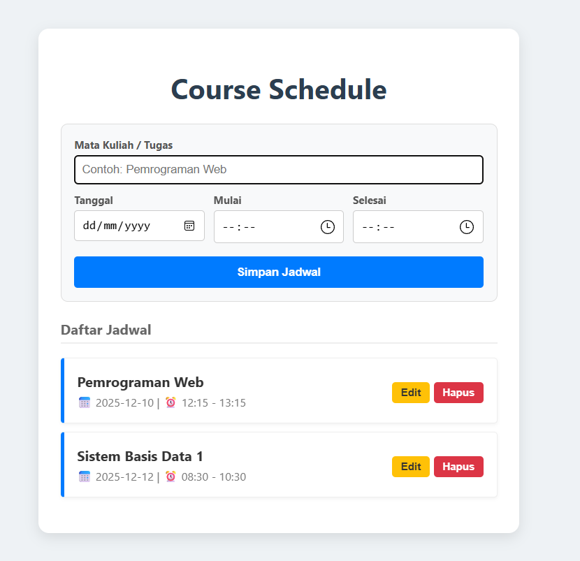

# 📅 MyCourse Schedule

**MyCourse Schedule** adalah aplikasi web manajemen jadwal kuliah dan tugas yang ringan dan responsif. Aplikasi ini dirancang untuk memenuhi tugas Pemrograman Web dengan mengimplementasikan operasi **CRUD** (Create, Read, Update, Delete) yang lengkap.

## 📸 Preview



---
## ✨ Fitur Unggulan

### 1. 📝 CRUD Komprehensif
* **Create**: Menambahkan jadwal Mata Kuliah, Tanggal, Jam Mulai, dan Jam Selesai.
* **Read**: Menampilkan daftar jadwal dalam format kartu yang rapi dan mudah dibaca.
* **Update**: Saat tombol "Edit" ditekan, data akan kembali ke formulir untuk diperbarui (*Form Binding*).
* **Delete**: Menghapus jadwal yang sudah tidak diperlukan dengan konfirmasi keamanan.

### 2. 💾 Local Storage
Data disimpan dalam format **JSON Object** di dalam memori browser pengguna.
* Data tidak hilang saat browser di-*refresh*.
* Tidak memerlukan koneksi internet atau database server backend.

## 🛠️ Teknologi yang Digunakan

Project ini tidak dibangun dengan *Backend* untuk kemudahan deployment dan kecepatan akses:

* **HTML5** - Semantik struktur web & Input type (Date/Time).
* **CSS3** - Styling custom (tanpa framework CSS berat).
* **JavaScript (ES6)** - Logika manipulasi DOM & Local Storage Management.

---

## 🚀 Cara Menjalankan

Project ini bersifat *client-side*, sehingga tidak memerlukan instalasi server (seperti XAMPP atau Node.js).

1.  **Clone Repository**
    ```bash
    git clone https://github.com/channdra101/MyCourse-schedule.git
    ```
2.  **Buka Folder Project**
    Masuk ke direktori penyimpanan hasil clone.
3.  **Jalankan Aplikasi**
    Klik dua kali file `index.html`. Aplikasi akan langsung berjalan di browser default Anda.

---

## 📂 Struktur Folder

```text
mycourse-schedule/
├── index.html      # UI Utama & Form Input
├── style.css       # Styling layout & komponen
├── script.js       # Logika CRUD & Local Storage
└── README.md       # Dokumentasi Project